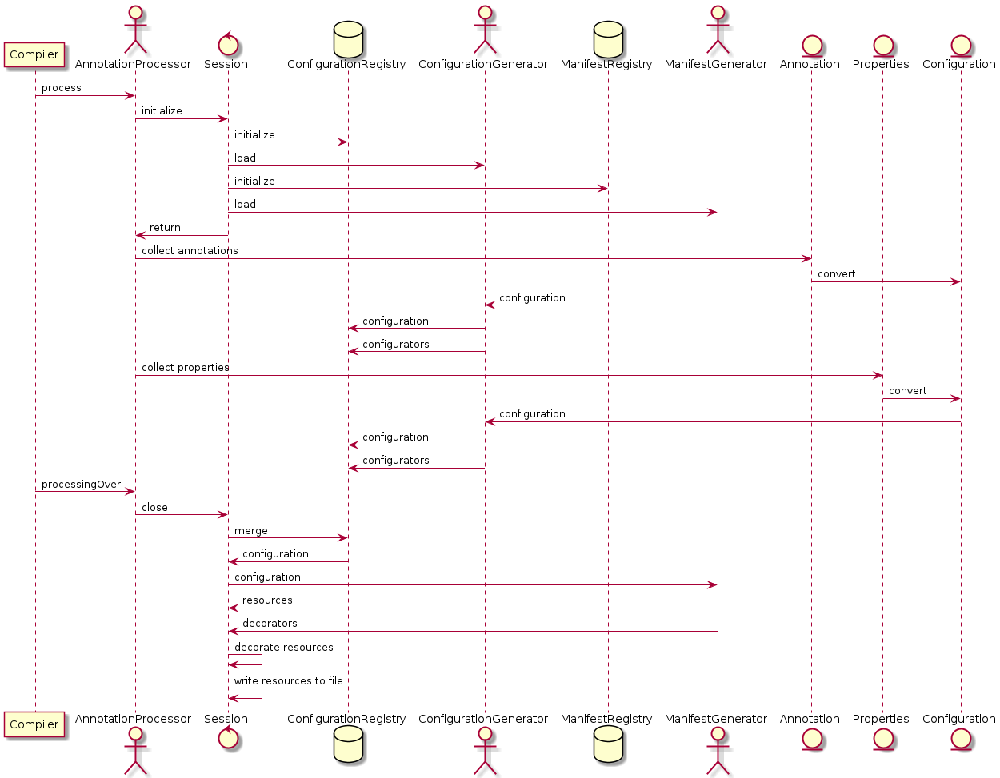

# Dekorate Design

## Overview
This section provides a high level overview on the design of Dekorate. The core building blocks are back-quoted and a definition
for them is provided in the next section (vocabulary).

Dekorate provides multiple annotation processors all targeting at the generation of Kubernetes resources.
Each annotation processor is "supporting" one or more annotations and will be called by the compiler at least twice when
the annotations are spotted. 

On each annotation processor invocation, information about the annotated classes are passed.
The last invocation signals the end of the processing.

When the processing is over, each processor will assemble a `config` object and pass it to the responsible `handler`.
The handlers role is to create or modify the `model` based on the `config`. 

Finally, the `model` is serialized to disk as json/yml.

[]

## Vocabulary

The section below describes the core parts of Dekorate and tries to describe how they work together.

### Visitor
Refers to the the `Gang of Four` visitor pattern. As Kubernetes resources are deeply nested we are extensively using the 
`visitor` pattern  to perform modifications to those resources without having to programmatically traverse this complex
structure.

### Model
With Kubernetes/OpenShift `model` or just `model` we refer to the java object representation of the Kubernetes/OpenShift
resource domain. The `model` has the same structure are the actual kubernetes resources and can be easily serialized into 
json or yml and form the actual resources.

The base interface that all `model` objects implement is the HasMetadata. For example:

     public class Pod implemnets HasMetadata {
     
       private String kind;
       private ObjectMeta metadata;
       
       public String getKind() {
         return this.kind;
       }
        
       public ObjectMeta getMetadata() {
          return this.metadata;
       }
     }

### Config

An object / pojo that encapsulates the information provided by an annotation and the project (e.g. name, version etc).
An example configuration is the `KubernetesConfig` class:

    public class KubernetesConfig  {
        private String group;
        private String name;
        private String version;
        private io.dekorate.kubernetes.config.Label[] labels;
        private io.dekorate.kubernetes.config.Annotation[] annotations;
        ...
    }

### ConfigurationGenerator

A service that given properties extracted from sources like:

- annotations 
- local configurations
- framework 

will convert them into a `Config` using a mapper and by applying various `Configurators` (see below).

### Configurator

A `configurator` is a visitor that visits parts of the `config` with the purpose of performing minor changes / updates.

For example a configurator that can be used to add a label to `KubernetesConfig`:

    public class AddLabel extends Configurator<KubernetesConfigFluent> {
    
         public void visit(KubernetesConfigFluent config) {
             config.addToLabels(new Label("createdBy", "dekorate");
         }
    }

| Configurator           | Target              | Description                                                                   |
|------------------------|---------------------|-------------------------------------------------------------------------------|
| ApplyOpenshiftConfig   | SourceToImageConfig | Applies group, name and version from OpenshiftConfig to SourceToImage config. |
| AddPort                | KubernetesConfig    | Adds a port to all containers.                                                |
| ApplyDockerBuildHook   | DockerBuildConfig   | Apply the docker build hook configuration.                                    |
| ApplySourceToImageHook | SourceToImageConfig | Apply source to image build hook.                                             |

### ManifestGenerator 

An object that processes a certain type of `config` with the purpose of generating a manifest.
In some cases a `ManifestGenerator` may not generate the whole manifest, but influence parts of it.
Usually such generators create `model` resources and register `decorators`.

     public class KubernetesManifestGenerator extends AbstractKubernetesManifestGenerator<KubernetesConfig> implements ManifestGenerator {

        public void generate(KubernetesConfig config) {
            resourceRegistry.add("kubernetes", createDeployment(config));
        }

        public boolean accepts(Class<? extends Configuration> type) {
          return type.equals(KubernetesConfig.class);
        }
    }

### Decorator

A `decorator` is a visitor that visits parts of the kubernetes/openshift `model` in order to perform minor changes / updates.
It's different than a `configurator` in the sense that it operates on the actual model instead of the `config`.

    public class AddLabel extends Decorator<PodFluent> {
    
         public void vist(PodFluent podFluent) {
             podFluent.addToLabels(new Label("createdBy", "dekorate");
         }
    }
    
    
The `decorator` looks pretty similar to the `configurator` the only difference between the two being the kind of objects they visit.

`Configurators` visit `config` objects.
`Decorators` visit `model` objects.

| Decorator                     | Target         | Description                                            |
|-------------------------------|----------------|--------------------------------------------------------|
| AddSecretVolume               | PodSpec        | Add a secret volume to all pod specs.                  |
| AddService                    | KubernetesList | Add a service to the list.                             |
| AddLivenessProbe              | Container      | Add a liveness probe to all containers.                |
| AddEnvVar                     | Container      | Add a environment variable to the container.           |
| AddReadinessProbe             | Container      | Add a readiness probe to all containers.               |
| AddConfigMapVolume            | PodSpec        | Add a configmap volume to the pod spec.                |
| AddEnvToComponent             | ComponentSpec  | Add environment variable to component.                 |
| AddAzureDiskVolume            | PodSpec        | Add an Azure disk volume to the pod spec.              |
| AddAnnotation                 | ObjectMeta     | A decorator that adds an annotation to all resources.  |
| AddMount                      | Container      | Add mount to all containers.                           |
| AddPort                       | Container      | Add port to all containers.                            |
| AddPvcVolume                  | PodSpec        | Add a persistent volume claim volume to all pod specs. |
| AddAwsElasticBlockStoreVolume | PodSpec        | Add an elastic block store volume to the pod spec.     |
| AddRuntimeToComponent         | ComponentSpec  | Add the runtime information to the component.          |
| AddLabel                      | ObjectMeta     | Add a label to the all metadata.                       |
| AddAzureFileVolume            | PodSpec        | Add an Azure File volume to the Pod spec.              |

#### Why do we need both Configurators and Decorators?

There are two main reasons:

- decoupling configuration sources from manifest generation logic
- working on a simplified representation of the model

##### Decoupling configuration sources from manifest generator logic

There are multiple configuration sources that contribute to the actual configuration that will be used for manifest generation:

- Annotations
- Property configuration
- Framework artifacts
- Defaults

Instead of coupling all those sources with the manifest generation logic, it is preferable to limit their scope to the creation of the config object.
So pratctically we are having two main processing phases:

- configuration creation
- manifest generation

Since, the config objects themselves are fluent buildable objects, that support the visitor pattern it felt natural to use it.
To distinguish between visitors that are acting on configuration vs visitors that are acting on the generated manifests we have `Configurator` and `Decorator` classes respectively.

##### Using a simplified model representation where it makes sense

The kubernetes `model` is very complex and deeply nested object structure and for a good reason: `It needs to fit to every signle deployment use case out there.`
The deployment of a java application though is something more concrete and can be described by something simpler than the actual model.

During the process of gathering and combining information from multiple annotation processors its more practical and less error prone to apply them to a more simplified representation of the `model`,
which is what the `config` essentially is. So, during the processing phase we use `configurators` to apply the information gathered in each step to the `config`.

Once the `configuration` is finalized, the actual `model` is populated. Since different `processors` are creating different kinds of `config` we need to combine them all in order to build the `model`.
This is where `decorators` come in place. Each `config` is translated to different `decorators` that contribute to different parts of the `model`.

##### Why not directly creating the model?
We have a variable number of `config` instances all contributing to the `model`. Combining them all in one go without the use of `decorators` would result in a conditional hell.

### Annotation Processor
Refers to Java annotation processors. Each processor is responsible for creating a `config` object and also for registering one or more `handler` that handle the `config`.
A processor may register more than one `config` `handlers` with no restriction on the kind of `config` they handle. 

| Processor                         | Config               | Supported Annotations                                                                                        | Description                                                       |
|-----------------------------------|----------------------|--------------------------------------------------------------------------------------------------------------|-------------------------------------------------------------------|
| KubernetesAnnotationProcessor     | KubernetesConfig     | [io.dekorate.kubernetes.annotation.KubernetesApplication]                                                        | Generates kubernetes manifests.                                   |
| OpenshiftAnnotationProcessor      | OpenshiftConfig      | [io.dekorate.kubernetes.annotation.KubernetesApplication, io.dekorate.openshift.annotation.OpenshiftApplication]     | Generates openshift manifests.                                    |
| SpringBootApplicationProcessor    | none                 | [org.springframework.boot.autoconfigure.SpringBootApplication]                                               | Detects Spring Boot and set the runtime attribute to Spring Boot. |
| ThorntailProcessor                | none                 | [javax.ws.rs.ApplicationPath, javax.jws.WebService]                                                          | Detects JAX-RS and JAX-WS annotations and registers the http port.  |
| SpringBootMappingProcessor        | none                 | [org.springframework.web.bind.annotation.RequestMapping, org.springframework.web.bind.annotation.GetMapping] | Detects Spring Boot web endpoints and registers the http port.    |

### Session
A shared repository between `annotation processors`. 
This repository holds `ConfigurationGenerators` and `ManifestGenerators`.
When the session is closed, All `ConfigurationGenerators` will be used to populate the `config` that is passed to the `ManifestGenerators`.
The `ManifestGenrators` generate and decorate the `model`. 
The resulting model is passed back to the `processor`.
