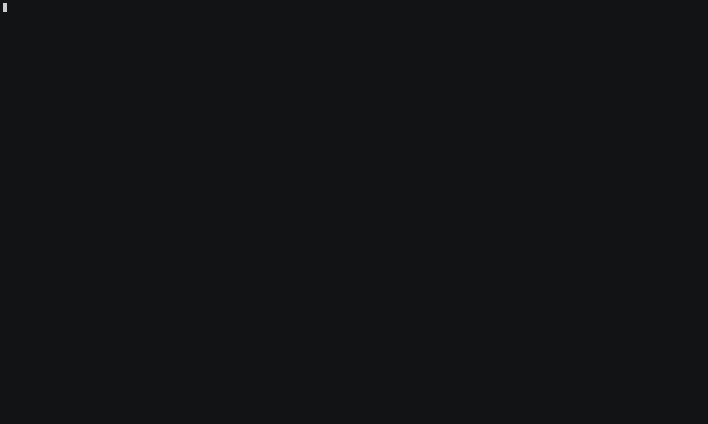

### Hello Quarkus

Add the following dependency to your project:

```xml
<dependency>
  <groupId>io.quarkus</groupId>
  <artifactId>quarkus-kubernetes</artifactId>
  <version>{{site.data.project.release.current-version}}</version>
</dependency>
```

That's all! Next time you perform a build, using something like:

    mvn clean package

The generated manifests can be found under `target/kubernetes`.
Note: [Quarkus](https://quarkus.io) is using its own `dekorate` based Kubernetes extension (see more at  [Quarkus](#quarkus)).


